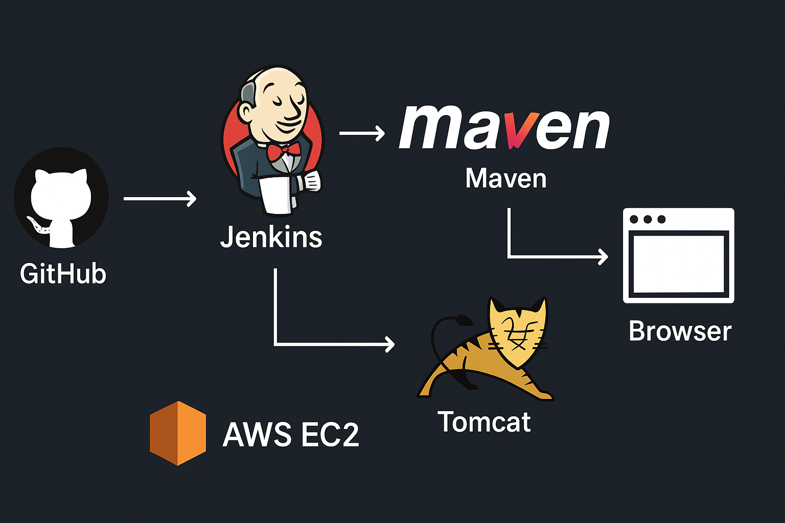
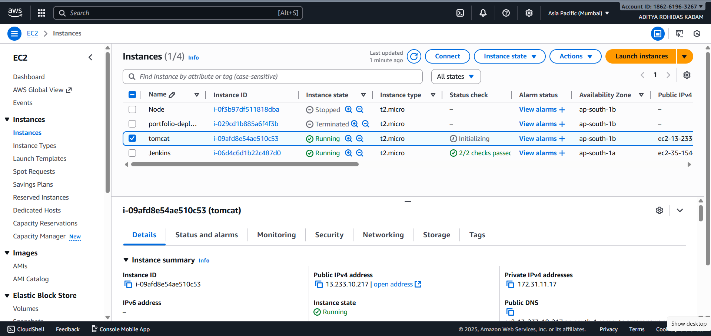
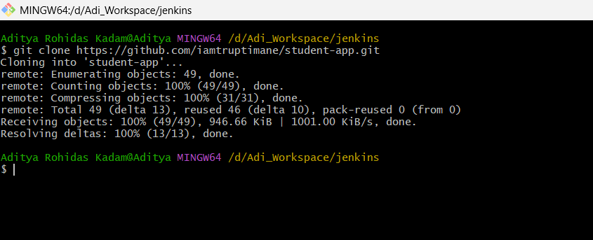
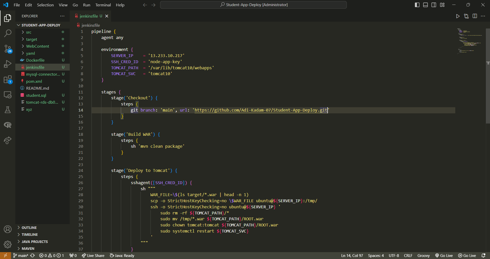
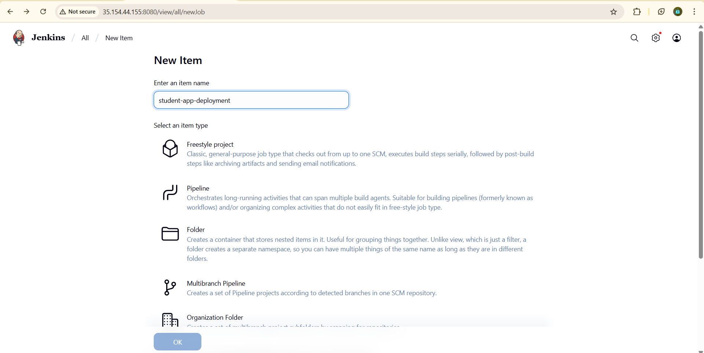
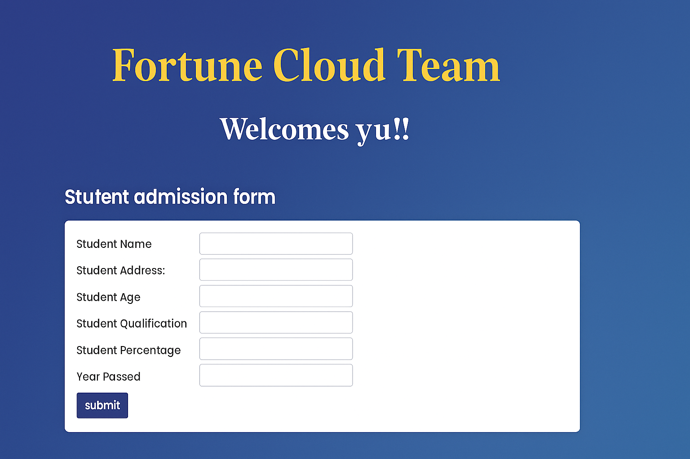

# Student-App-Deploy | Java CI/CD with Jenkins, Maven & Tomcat on AWS

This project demonstrates **automated deployment of a Java-based Student Application** using a complete **Jenkins CI/CD pipeline** integrated with **Maven** and **Apache Tomcat** — all hosted on **AWS EC2 instances**.  

---

## Project Overview / Architecture :

The goal of this project is to **automate build, test, and deployment** of a Java web application using Jenkins CI/CD.  
The app is deployed on a Tomcat server running on AWS, ensuring smooth and continuous integration and delivery.




---


##  Tech Stack :

| Component | Description |
|------------|-------------|
| **Language** | Java |
| **Build Tool** | Apache Maven |
| **CI/CD Tool** | Jenkins |
| **Application Server** | Apache Tomcat |
| **Cloud Platform** | AWS EC2 |
| **Code Editor** | Visual Studio Code |
| **Version Control** | Git & GitHub |

---

## Architecture Setup :

### Server 1: Jenkins Server
- Installed Jenkins  
- Installed Maven  
- Configured Git and environment variables  

### Server 2: Tomcat Server
- Installed Apache Tomcat  
- Deployed WAR file generated from Jenkins pipeline  



---

## CI/CD Workflow

1. **Launch Two EC2 Instances**  
   - One for **Jenkins**  
   - One for **Tomcat**

2. **Install Dependencies**
   - On Jenkins server → install **Maven**  
   - On Tomcat server → install **Tomcat**

3. **Clone the Project**
   ```bash
   git clone <your-github-repo-url>



---

### Open in VS Code, edit the Jenkinsfile, and configure environment variables.

- ### Jenkins File :


---

## 4. Create Jenkins Pipeline Job

- Open Jenkins → Create New Item

- Enter job name: student-app-deployment1

- Choose Pipeline

- Under Pipeline Definition: select Git SCM

- Paste your GitHub repository URL

- Choose the main branch

- Click Save




## Access the Application

- Open your browser and type:

- http://server_pub-ip:8080


- ### The Student Application will be live :



## Author :

- Gmail : 
adityakadam56738@gmail.com

- Project deployed and maintained using AWS + Jenkins + Tomcat + Maven


## Conclusion :

#### This project proves how DevOps automation simplifies software deployment and speeds up delivery.
#### It’s an ideal setup for students and professionals learning CI/CD pipelines using Java and AWS.

